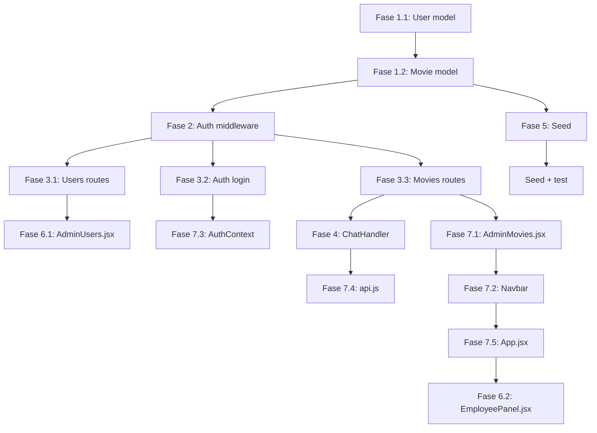

# Roadmap: CineClub v2 — Roles, Empleados y Programación de Películas

## Resumen del objetivo

Transformar CineClub de un sistema con un único rol `admin` a una plataforma multi-rol (admin, manager, employee, client) donde las películas tienen **fechas de exhibición** (screenings) y desaparecen del catálogo público una vez vencidas, pudiendo re-estrenarse agregando nuevos períodos.

---

## Roles del sistema

| Rol | Permisos |
|-----|----------|
| **admin** | CRUD completo (películas, directores, géneros, tiendas, usuarios). Sin restricción de tienda. |
| **manager** | CRUD películas, directores, géneros + screenings en tiendas que administra. No gestiona usuarios. |
| **employee** | Solo lectura del catálogo + modificar copias/fechas de screenings en su tienda asignada. |
| **client** | Ver catálogo público + chat + (futuro) reservar boletos para funciones. |

---

## Estructura de archivos a crear/modificar

### Backend (13 archivos)

| Archivo | Acción |
|---------|--------|
| `backend/models/User.js` | Modificar — agregar `role`, `name`, `store`, `active` |
| `backend/models/Movie.js` | Modificar — `availability` → `screenings`, `year` → `releaseDate` |
| `backend/middleware/auth.js` | Refactor — separar `authenticate` y `requireRole`, agregar `requireStoreAccess` |
| `backend/routes/users.js` | **Crear** — CRUD empleados |
| `backend/routes/auth.js` | Modificar — devolver `name`, `role`, `store` en login |
| `backend/routes/movies.js` | Modificar — filtrar por screenings activos |
| `backend/server.js` | Modificar — agregar rutas de users, nuevo middleware |
| `backend/sockets/chatHandler.js` | Modificar — filtrar solo activas + fechas en contexto |
| `backend/seed.js` | Modificar — screenings con fechas + usuarios multi-rol |
| `backend/.env` | Sin cambios |
| `backend/services/ollamaService.js` | Sin cambios |
| `backend/services/intentFilter.js` | Sin cambios |
| `backend/models/Director.js` | Sin cambios |
| `backend/models/Genre.js` | Sin cambios |
| `backend/models/Store.js` | Sin cambios |

### Frontend (11 archivos)

| Archivo | Acción |
|---------|--------|
| `frontend/src/pages/AdminUsers.jsx` | **Crear** — gestión de empleados |
| `frontend/src/pages/EmployeePanel.jsx` | **Crear** — panel de empleado |
| `frontend/src/pages/AdminMovies.jsx` | Modificar — screenings con fechas y DatePicker |
| `frontend/src/pages/AdminDashboard.jsx` | Modificar — enlaces según rol |
| `frontend/src/pages/AdminStores.jsx` | Sin cambios |
| `frontend/src/pages/Login.jsx` | Sin cambios |
| `frontend/src/components/layout/Navbar.jsx` | Modificar — menú según rol |
| `frontend/src/context/AuthContext.jsx` | Modificar — guardar `role`, `name`, `store` |
| `frontend/src/services/api.js` | Modificar — agregar endpoints de users y screenings |
| `frontend/src/App.jsx` | Modificar — rutas protegidas por rol |
| `frontend/src/components/catalog/MovieGrid.jsx` | Sin cambios (consume API que ya filtra) |

---

## Fase 1 — Modelos (Backend)

### 1.1 Actualizar `models/User.js`

**Cambios:**
- Ampliar `role` de `['admin']` a `['admin', 'manager', 'employee', 'client']`
- Agregar campo `name: String`
- Agregar campo `store: { type: ObjectId, ref: 'Store' }` (nullable, solo para manager/employee)
- Agregar campo `active: { type: Boolean, default: true }`

**Esquema resultante:**
```
User {
    email: String (required, unique, lowercase)
    password: String (required, hasheado con bcrypt)
    name: String
    role: ['admin', 'manager', 'employee', 'client']
    store: ObjectId -> Store (nullable)
    active: Boolean (default true)
    timestamps
}
```

**Pre-save hook:** Sin cambios (sigue hasheando password).

### 1.2 Actualizar `models/Movie.js`

**Cambios:**
- Eliminar `availability: [availabilitySchema]`
- Eliminar `year: Number`
- Agregar `releaseDate: Date` (opcional)
- Agregar `screenings: [screeningSchema]`

**Nuevo sub-esquema:**
```
screeningSchema {
    store: ObjectId -> Store (required)
    startDate: Date (required)
    endDate: Date (required)
    copies: Number (default 0)
}
```

**Esquema resultante:**
```
Movie {
    title: String (required)
    releaseDate: Date (opcional, reemplaza year)
    synopsis: String
    duration: Number
    rating: ['G', 'PG', 'PG-13', 'R', 'NC-17']
    poster: String (antes imageUrl)
    director: ObjectId -> Director
    genres: [ObjectId -> Genre]
    screenings: [screeningSchema]
    timestamps
}

Text index: title, synopsis
```

---

## Fase 2 — Middleware de autorización (Backend)

### 2.1 Refactorizar `middleware/auth.js`

Separar en tres funciones exportables:

```js
// 1. Solo verifica token y decodifica
authenticate(req, res, next)

// 2. Verifica que el rol esté en la lista permitida
requireRole(...roles)

// 3. Verifica que el usuario tenga acceso a la tienda especificada
//    (compara req.user.store con storeId de params/body)
requireStoreAccess()
```

**Comportamiento:**
- `authenticate`: si no hay token → 401. Si hay token inválido → 401. Si es válido → `req.user = decoded`, next().
- `requireRole('admin', 'manager')`: si `req.user.role` no está en la lista → 403.
- `requireStoreAccess`: si `req.user.role === 'admin'` → ok siempre. Si es manager/employee, compara con el `storeId`. Si no coincide → 403.

**Uso en rutas:**
```js
// Ejemplo para crear película
router.post('/', authenticate, requireRole('admin', 'manager'), async (req, res) => { ... })

// Ejemplo para crear usuario (solo admin)
router.post('/', authenticate, requireRole('admin'), async (req, res) => { ... })
```

### 2.2 Actualizar `server.js`

- Importar `authenticate`, `requireRole` desde el middleware renovado
- Reemplazar el `requireAdmin` actual
- Las rutas GET de catálogo siguen siendo públicas (sin authenticate)
- Las rutas POST/PUT/DELETE de películas/directores/géneros/tiendas: `[authenticate, requireRole('admin', 'manager')]`
- Las rutas de usuarios: `[authenticate, requireRole('admin')]`

```
Rutas actualizadas en server.js:

GET  /api/health              → público
POST /api/auth/login          → público

GET  /api/movies              → público (filtra solo activas)
POST /api/movies              → authenticate + requireRole('admin','manager')
PUT  /api/movies/:id          → authenticate + requireRole('admin','manager')
DELETE /api/movies/:id        → authenticate + requireRole('admin')

GET  /api/directors           → público
POST /api/directors           → authenticate + requireRole('admin','manager')
...

GET  /api/genres              → público
POST /api/genres              → authenticate + requireRole('admin','manager')
...

GET  /api/stores              → público
POST /api/stores              → authenticate + requireRole('admin')
...

GET    /api/users             → authenticate + requireRole('admin')
POST   /api/users             → authenticate + requireRole('admin')
PUT    /api/users/:id         → authenticate + requireRole('admin')
DELETE /api/users/:id         → authenticate + requireRole('admin')
```

---

## Fase 3 — Nuevas rutas (Backend)

### 3.0 `routes/auth.js` — Registro de clientes

**Nuevo endpoint:**
```
POST /api/auth/register → público
Body: { email, password, name }
→ Crea usuario con role: 'client'
→ Devuelve token + { email, name, role, store: null }
```

**Reglas:**
- No requiere autenticación (cualquier persona puede registrarse)
- Email único (validado por mongoose)
- El cliente se crea con `role: 'client'` y sin tienda asignada

### 3.1 `routes/users.js` — CRUD de empleados

**Endpoints:**

```
GET    /api/users       → lista todos los usuarios (solo admin)
POST   /api/users       → crear usuario (admin asigna rol y tienda)
PUT    /api/users/:id   → editar email, rol, tienda, active
DELETE /api/users/:id   → eliminar usuario
```

**Reglas de negocio:**
- Admin puede crear/editar cualquier usuario
- No se puede eliminar el último admin
- Al crear, se requiere: email, password, name, role
- store solo es obligatorio si role === 'manager' o 'employee'

### 3.2 `routes/auth.js` — Modificar login

**Cambio:** El endpoint `POST /api/auth/login` ahora devuelve también `name` y `store` (opcional, para clientes es null):

```json
{
    "token": "jwt...",
    "user": {
        "email": "admin@cineclub.com",
        "name": "Admin Principal",
        "role": "admin",
        "store": null
    }
}
```

### 3.3 `routes/movies.js` — Filtrar por screenings activos

**GET /api/movies** — ahora filtra:

```js
const now = new Date()
let filter = {
    'screenings.startDate': { $lte: now },
    'screenings.endDate': { $gte: now }
}
```

- Usuarios autenticados con rol admin/manager pueden pasar `?all=true` para ver todas (incluyendo vencidas)
- El filtro por texto `?search=` se aplica además del filtro de screenings

**POST /api/movies** — crear película:
- El body ahora acepta `screenings` en lugar de `availability`
- Cada screening: `{ store, startDate, endDate, copies }`
- Manager solo puede asignar screenings a sus tiendas (validar con `requireStoreAccess`)

---

## Fase 4 — Chatbot con screenings (Backend)

### 4.1 Actualizar `sockets/chatHandler.js`

**Dos cambios principales:**

**a) Filtrar solo películas activas en `searchCatalog`:**
```js
const now = new Date()
const activeFilter = {
    'screenings.startDate': { $lte: now },
    'screenings.endDate': { $gte: now }
}
// Añadir activeFilter a todas las consultas de Movie.find()
```

**b) Incluir fechas en el contexto de Ollama:**
```js
disponibilidad: m.screenings
    .filter(s => s.startDate <= now && s.endDate >= now)
    .map(s => ({
        tienda: s.store?.name,
        desde: s.startDate.toLocaleDateString('es-MX'),
        hasta: s.endDate.toLocaleDateString('es-MX'),
        copias: s.copies
    }))
```

Esto permite que Ollama responda: *"Interestelar está disponible en la tienda Centro hasta el 15 de junio de 2026."*

---

## Fase 4.5 — Modelo Reservation (Futuro, no implementar ahora)

Cuando se implemente el sistema de reservas:

```js
Model Reservation {
    user: ObjectId -> User (ref, cliente que reserva)
    movie: ObjectId -> Movie (ref, película seleccionada)
    store: ObjectId -> Store (ref, tienda donde se verá)
    screeningDate: Date        // fecha específica de la función
    status: 'confirmed' | 'cancelled'
    createdAt: Date
}
```

**Reglas de negocio (futuras):**
- 1 reserva = 1 boleto para 1 función
- Se puede reservar hasta 1 día antes de `screeningDate`
- La fecha debe estar dentro del rango `startDate - endDate` del screening de la película
- El cliente puede ver/cancelar sus reservas en `/mis-reservas`

---

## Fase 5 — Seed actualizado (Backend)

### 5.1 `seed.js`

**Datos de prueba:**

**Usuarios (5):**
| email | password | role | store |
|-------|----------|------|-------|
| admin@cineclub.com | admin123 | admin | null |
| manager.centro@cineclub.com | manager123 | manager | Centro |
| manager.sur@cineclub.com | manager123 | manager | Sur |
| empleado.norte@cineclub.com | empleado123 | employee | Norte |
| cliente@cineclub.com | cliente123 | client | null |

**Películas con screenings (6 películas, distribución variada):**

| Película | Screenings |
|----------|------------|
| Psicosis | Centro: 01/05/2026 → 30/06/2026 (2 copias), Norte: 01/05/2026 → 15/06/2026 (1 copia) |
| Inception | Centro: 01/06/2026 → 30/06/2026 (3 copias), Norte: 01/06/2026 → 30/06/2026 (2 copias), Sur: 01/06/2026 → 30/06/2026 (2 copias) |
| Interestelar | Centro: 15/06/2026 → 15/07/2026 (2 copias), Sur: 15/06/2026 → 15/07/2026 (1 copia) |
| Barbie | Centro: 01/01/2026 → 15/01/2026 (4 copias) — **expirada** + Centro: 01/07/2026 → 15/07/2026 (4 copias) — **futura** (re-estreno) |
| El laberinto del fauno | Sur: 01/06/2026 → 30/06/2026 (2 copias) |
| La forma del agua | Norte: 01/06/2026 → 15/06/2026 (1 copia) — **por expirar** |

**Directores (5):** Sin cambios.
**Géneros (6):** Sin cambios.
**Tiendas (3):** Sin cambios (Centro, Norte, Sur).

---

## Fase 6 — Frontend: Nuevas páginas

### 6.1 `pages/AdminUsers.jsx` — Gestión de empleados

**Vista:**
- Tabla con: nombre, email, rol, tienda asignada, activo/inactivo
- Diálogo para crear/editar con campos: email, password (solo al crear), nombre, rol (select), tienda (select, solo si no es admin), activo (checkbox)
- Botón para desactivar/reactivar sin eliminar

**Seguridad:**
- Solo accesible por admin
- El admin no puede cambiarse el rol a sí mismo ni desactivarse

### 6.2 `pages/EmployeePanel.jsx` — Panel de empleado

**Vista simplificada:**
- Muestra solo el nombre de su tienda asignada
- Lista de películas activas en su tienda (con screenings activos)
- Por cada película: puede modificar `copias` de los screenings activos
- Puede ver datos de la película pero no editarlos
- **No** tiene acceso a crear/editar películas, directores, géneros

---

## Fase 7 — Frontend: Modificaciones

### 7.1 `pages/AdminMovies.jsx` — Rediseñar formulario

**Cambios en el formulario de película:**
- `title` → TextField (sin cambios)
- `releaseDate` → DatePicker (nuevo, reemplaza `year`)
- `synopsis` → TextField multiline (sin cambios)
- `duration` → TextField number (sin cambios)
- `rating` → Select (sin cambios)
- `director` → Select (sin cambios)
- `genres` → Select multiple (sin cambios)
- `screenings` → Bloques por tienda:

```
=== Disponibilidad (Screenings) ===

[Tienda: Centro] ____________________________________
  Fecha inicio: [____/____/____]  Fecha fin: [____/____/____]  Copias: [__]
  Fecha inicio: [____/____/____]  Fecha fin: [____/____/____]  Copias: [__]  [x]
  [+ Agregar otro screening en Centro]

[Tienda: Norte] ____________________________________
  Fecha inicio: [____/____/____]  Fecha fin: [____/____/____]  Copias: [__]
  [+ Agregar otro screening en Norte]
...
```

- Cada screening tiene su propio botón de eliminar
- Botón "+" para agregar múltiples screenings por tienda (re-estrenos)

**Visualización en tabla:**
- Columna "Estado": muestra "En cartelera", "Próximamente" o "Archivada" según screenings
- Para admin/manager: ver todas, incluyendo archivadas
- Indicador de fechas activas

### 7.2 `components/layout/Navbar.jsx` — Menú según rol

```jsx
// Admin: [Dashboard] [Películas] [Directores] [Géneros] [Tiendas] [Usuarios]
// Manager: [Dashboard] [Películas] [Directores] [Géneros] [Tiendas]
// Employee: [Mi Tienda]
```

- Si el usuario tiene rol employee, redirigir a `/employee` en lugar de `/admin`
- Ocultar enlaces a secciones que no puede ver

### 7.3 `context/AuthContext.jsx` — Guardar más datos

Al hacer login, guardar en localStorage y en el estado:
```js
{
    email: "user@cineclub.com",
    name: "Juan Pérez",
    role: "manager",
    store: { _id: "...", name: "Centro" }
}
```

### 7.4 `services/api.js` — Nuevos endpoints

Agregar:
```js
// Usuarios
export const getUsers = () => api.get('/users')
export const createUser = (data) => api.post('/users', data)
export const updateUser = (id, data) => api.put(`/users/${id}`, data)
export const deleteUser = (id) => api.delete(`/users/${id}`)

// Screenings (opcional, puede manejarse desde movies)
export const addScreening = (movieId, data) => api.post(`/movies/${movieId}/screenings`, data)
export const updateScreening = (movieId, screeningId, data) => api.put(`/movies/${movieId}/screenings/${screeningId}`, data)
export const deleteScreening = (movieId, screeningId) => api.delete(`/movies/${movieId}/screenings/${screeningId}`)
```

### 7.5 `App.jsx` — Rutas protegidas por rol

Modificar `ProtectedRoute` para aceptar `roles`:
```jsx
function ProtectedRoute({ children, roles }) {
    const token = localStorage.getItem('token')
    const user = JSON.parse(localStorage.getItem('user') || '{}')
    if (!token) return <Navigate to="/login" replace />
    if (roles && !roles.includes(user.role)) return <Navigate to="/" replace />
    return children
}
```

Nuevas rutas:
```jsx
<Route path="/admin/users" element={<ProtectedRoute roles={['admin']}><AdminUsers /></ProtectedRoute>} />
<Route path="/employee" element={<ProtectedRoute roles={['employee', 'manager']}><EmployeePanel /></ProtectedRoute>} />
```

---

## Fase 8 — Catálogo público + Recomendaciones (Frontend)

### 8.1 `MovieGrid.jsx` — Sin cambios mayores

- Ya consume `GET /api/movies` que filtra solo activas
- Opcional: agregar indicador visual de fechas de disponibilidad ("Hasta el 30/06")

---

## Resumen de orden de implementación sugerido



Orden recomendado para implementar:

| Paso | Archivos | Depende de |
|------|----------|------------|
| 1 | `models/User.js` | — |
| 2 | `models/Movie.js` | — |
| 3 | `middleware/auth.js` | 1 |
| 4 | `routes/users.js` | 1, 3 |
| 5 | `routes/auth.js` | 1 |
| 6 | `routes/movies.js` | 2, 3 |
| 7 | `sockets/chatHandler.js` | 2 |
| 8 | `seed.js` | 1, 2 |
| 9 | `server.js` | 3, 4, 5, 6 |
| 10 | `services/api.js` | — |
| 11 | `context/AuthContext.jsx` | 5 |
| 12 | `pages/AdminUsers.jsx` | 4, 10 |
| 13 | `pages/AdminMovies.jsx` | 2, 10 |
| 14 | `pages/EmployeePanel.jsx` | 10 |
| 15 | `components/layout/Navbar.jsx` | 11 |
| 16 | `pages/AdminDashboard.jsx` | 11 |
| 17 | `App.jsx` | 11, 15, 16 |
